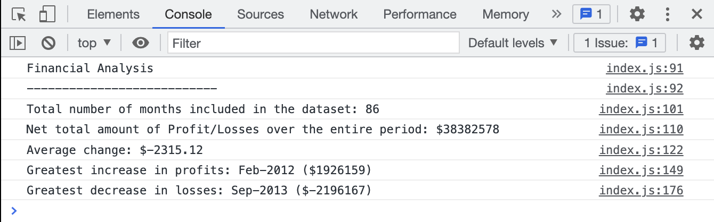

# Console Finances

## Description
Creating JavaScript code to print a number of financial calculations to the console using a dataset provided of financial information.

The goals for the project include:

1. Display the total number of months in the dataset
2. Display the net total amount of Profit/Losses over the entire period
3. Display the average of the changes in Profit/Losses over the total period
4. Display the greatest increase in profits, including the date and amount, over the entire period
5. Display the greatest decrease in losses, including the date and amount, over the entire period

To visit the website, [please click this link.](https://bethanyryalls.github.io/Console-Finances/)

## Table of Contents
- [Description](#description)
- [Installation/Usage](#installationusage)
- [Resources](#resources)
- [Contributors](#contributors)
- [License](#license)

## Installation/Usage

### Screenshot
The following screenshot shows the console displaying the above criteria
    

### Users
To visit the website, [please click this link.](https://bethanyryalls.github.io/Console-Finances/)

You will be directed to the webpage where you can then inspect the console to view the financial calculations.

### Developers
Navigate to the main page of the repository
Click the green 'Code' button and copy the SSH or HTTPS key
In terminal (Mac) or Git Bash (Windows) clone into the directory you want the repo in using the 'git clone' command followed by pasting your SSH or HTTPS key
Open the directory in your code editor
Inspect the index.html file and index.js file, you can change the dataset or add additional calculations

## Resources
- [Stack Overflow](https://stackoverflow.com)

## Contributors
The following were present during a classtime breakout room, no commits were made by them:
- [Natalie Navickas](https://github.com/NNavickas)
- [Nathan Crockwell](https://github.com/NatCro)

## License

